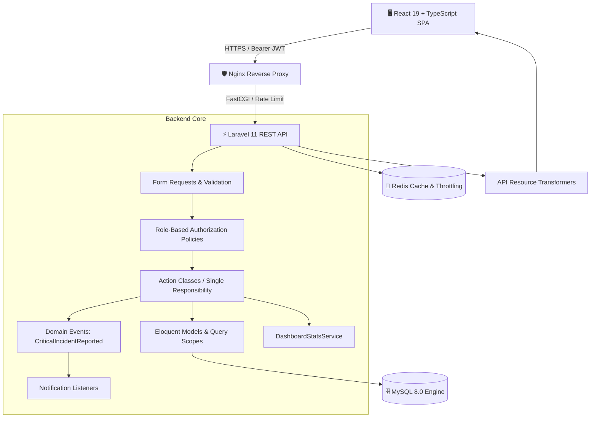

# 🏭 Enterprise Asset & Maintenance Management System
> **Sistema Integral de Gestión de Activos Fijos, Incidencias Críticas y Mantenimiento Preventivo/Correctivo para Entornos Industriales.**


-44CC11?logo=checkmarx&logoColor=white)
[](./SYSTEM_SPECIFICATIONS.md)

> 📖 **Documento Completo de Especificaciones y Entrega:** Consulta [SYSTEM_SPECIFICATIONS.md](./SYSTEM_SPECIFICATIONS.md) para ver la especificación detallada de Requerimientos Funcionales (RF), Requerimientos No Funcionales (RNF), Diagramas ERD y Matriz RBAC.

---

## 📌 1. Resumen Ejecutivo y Valor de Negocio

En entornos industriales y tecnológicos corporativos, el tiempo de inactividad no planificado (*unplanned downtime*) representa pérdidas de miles de dólares por hora. 

Este sistema resuelve la trazabilidad de ciclo de vida de activos físicos y lógicos, orquestando:
1. **Inventario de Activos con Trazabilidad Total:** Registro con códigos de inventario únicos, costos de adquisición, categorización jerárquica y estados en tiempo real (`active`, `in_maintenance`, `damaged`, `decommissioned`).
2. **Mesa de Ayuda & Gestión de Incidencias:** Reporte de fallas con severidad (`low`, `medium`, `high`, `critical`) y auto-transición de estados del activo ante emergencias.
3. **Planificación de Mantenimientos:** Programación de intervenciones preventivas y correctivas con detección de solapamiento de horarios y bloqueo de activos duplicados.
4. **Dashboard Ejecutivo & KPIs:** Cálculo en tiempo real de tasa de disponibilidad de activos, costos acumulados de mantenimiento, distribución de incidencias y equipos críticos.

---

## 🏗️ 2. Arquitectura del Sistema

El proyecto sigue los principios de **Clean Architecture**, **SOLID** y el patrón **Action-Domain-Responder (ADR)** para desacoplar completamente la lógica de negocio del framework web.



---

## 🔑 3. Cuentas de Acceso Demostrativas (RBAC)

El sistema incluye 4 cuentas precargadas en la base de datos para probar la granularidad de permisos:

| Rol | Correo Electrónico | Contraseña | Permisos y Capacidades en el Sistema |
| :--- | :--- | :--- | :--- |
| 🛡️ **Administrador** | `admin@example.com` | `password` | **Super-Admin Bypass**: Gestión total de usuarios, eliminación física/lógica de activos y catálogos. |
| 📋 **Supervisor** | `supervisor@example.com` | `password` | Creación y edición de activos, planificación de mantenimientos y asignación técnica. |
| 🔧 **Técnico** | `tecnico@example.com` | `password` | Visualización de activos asignados, resolución técnica de incidentes y ejecución de órdenes. |
| 👤 **Usuario Operador** | `usuario@example.com` | `password` | Consulta de inventario en modo lectura y reporte de nuevas incidencias operativas. |

> 💡 **Tip:** En la pantalla de login (`http://localhost:5173/login`), dispones de botones de **Acceso Rápido 1-Click** para auto-completar cualquiera de estos roles al instante.

---

## ✨ 4. Destacados de Ingeniería y Buenas Prácticas

- **Thin Controllers & Action Classes:** Los controladores delegan la mutación del dominio a clases de acción reutilizables (`CreateAssetAction`, `UpdateIncidentStatusAction`, `ScheduleMaintenanceAction`).
- **Domain Events Desacoplados:** Al registrar una incidencia crítica (`critical`), se dispara el evento de dominio `CriticalIncidentReported`, que a través del listener `NotifySupervisorsOfCriticalIncident` conmuta automáticamente el activo a estado `in_maintenance` y notifica a los supervisores.
- **Filtros Dinámicos con Query Scopes:** Búsqueda full-text en múltiples columnas (`code`, `name`), filtrado por Enums PHP 8.3 (`AssetStatus`, `IncidentSeverity`) y ordenamiento seguro contra inyección SQL.
- **Protección de Seguridad OWASP:**
  - Limitación de tasa contra ataques de fuerza bruta (`throttle:auth` - 5 intentos/minuto).
  - Limitación de tasa en API general (`throttle:api` - 60 peticiones/minuto).
  - Políticas de CORS restrictivas.
  - Prevención de *Mass Assignment* mediante FormRequests tipados y `$fillable` explícito.
- **Documentación Interactiva OpenAPI 3.1:** Documentación viva generada con **Dedoc Scramble** en `/docs/api` y colección descargable para **Postman v2.1**.

---

## 🚀 5. Guía de Puesta en Marcha

### Opción A: Despliegue con Docker Compose (Recomendado)

Requiere tener instalado [Docker Desktop](https://www.docker.com/products/docker-desktop/).

```powershell
# 1. Clonar el repositorio
git clone https://github.com/educhavez25/gestion-activos-mantenimiento.git
cd gestion-activos-mantenimiento

# 2. Configurar variables de entorno
cp .env.docker.example .env

# 3. Construir y levantar todos los contenedores en segundo plano
docker compose up -d --build

# 4. Ejecutar migraciones y datos de prueba
docker compose exec backend php artisan migrate --seed
```

- **Frontend:** [http://localhost:5173](http://localhost:5173)
- **API Backend / Swagger Docs:** [http://localhost:8000/docs/api](http://localhost:8000/docs/api)
- **MySQL:** Puerto `3308` (Host)

---

### Opción B: Ejecución Local en Host

#### Requisitos Previos
- **PHP >= 8.3** con extensiones `pdo_mysql`, `mbstring`, `bcmath`, `zip`.
- **Composer >= 2.7**
- **Node.js >= 20.x** & **NPM**
- **MySQL Server**

#### 1. Backend (Laravel 11)
```powershell
cd backend
composer install
cp .env.example .env
php artisan key:generate

# Configurar credenciales de base de datos en backend/.env y luego:
php artisan migrate --seed

# Iniciar servidor API
php artisan serve
```

#### 2. Frontend (React 19 + Vite)
```powershell
cd ../frontend
npm install
npm run dev
```

---

## 🧪 6. Suite de Pruebas Automatizadas

El backend cuenta con una cobertura integral de pruebas unitarias y de integración feature utilizando **PHPUnit**:

```powershell
cd backend
php artisan test
```

### 📊 Cobertura de Tests:
```
  PASS  Tests\Unit\ExampleTest
  PASS  Tests\Feature\Asset\AssetManagementTest (8 tests)
  PASS  Tests\Feature\Auth\AuthenticationTest (8 tests)
  PASS  Tests\Feature\Catalog\CatalogManagementTest (4 tests)
  PASS  Tests\Feature\Dashboard\DashboardStatsTest (2 tests)
  PASS  Tests\Feature\Incident\IncidentManagementTest (5 tests)
  PASS  Tests\Feature\Maintenance\MaintenanceManagementTest (6 tests)
  PASS  Tests\Feature\Security\RateLimitingTest (2 tests)

  Tests:    37 passed (150 assertions)
  Duration: ~1.50s
```

---

## 📡 7. Catálogo de Endpoints RESTful (API v1)

| Módulo | Método | Endpoint | Middleware / Autorización | Descripción |
| :--- | :--- | :--- | :--- | :--- |
| **Auth** | `POST` | `/api/v1/auth/login` | `throttle:auth` | Autenticación y generación de Bearer Token. |
| **Auth** | `POST` | `/api/v1/auth/register` | `throttle:auth` | Registro de nuevo usuario. |
| **Auth** | `GET` | `/api/v1/auth/me` | `auth:sanctum` | Obtener perfil y rol del usuario autenticado. |
| **Auth** | `POST` | `/api/v1/auth/logout` | `auth:sanctum` | Revocación del token actual. |
| **Dashboard** | `GET` | `/api/v1/dashboard/stats` | `auth:sanctum` | KPIs ejecutivos, costos acumulados y métricas. |
| **Activos** | `GET` | `/api/v1/assets` | `auth:sanctum` | Listado paginado con búsqueda y filtros de estado/categoría. |
| **Activos** | `POST` | `/api/v1/assets` | `can:create,Asset` | Creación de nuevo activo con código único. |
| **Activos** | `GET` | `/api/v1/assets/{id}` | `can:view,asset` | Detalle del activo e historial relacionado. |
| **Activos** | `PUT` | `/api/v1/assets/{id}` | `can:update,asset` | Actualización de datos del activo. |
| **Activos** | `DELETE` | `/api/v1/assets/{id}` | `can:delete,asset` | Eliminación lógica (*Soft Delete* - Admin only). |
| **Incidencias**| `GET` | `/api/v1/incidents` | `auth:sanctum` | Listado de incidencias con filtros de severidad y estado. |
| **Incidencias**| `POST` | `/api/v1/incidents` | `auth:sanctum` | Reporte de incidencia (Dispara evento de dominio). |
| **Incidencias**| `PATCH`| `/api/v1/incidents/{id}/status` | `can:updateStatus,incident` | Transición de estado (`in_progress`, `resolved`, `closed`). |
| **Mantenimientos**| `GET` | `/api/v1/maintenances` | `auth:sanctum` | Listado de mantenimientos programados y completados. |
| **Mantenimientos**| `POST` | `/api/v1/maintenances` | `can:create,MaintenanceRecord` | Programación con validación de solapamiento de fechas. |
| **Catálogos** | `GET` | `/api/v1/categories` | `auth:sanctum` | Catálogo de categorías de activos. |
| **Catálogos** | `GET` | `/api/v1/locations` | `auth:sanctum` | Catálogo de ubicaciones físicas y plantas. |
| **Usuarios** | `GET` | `/api/v1/users` | `auth:sanctum` | Listado de personal y técnicos filtrables por rol. |

---

## 📂 8. Estructura del Repositorio

```
gestion-activos-mantenimiento/
├── .github/
│   └── workflows/
│       └── ci.yml                 # Pipeline CI/CD (PHPUnit + MySQL + Node Build + Docker)
├── docker-compose.yml             # Orquestación de contenedores
├── .env.docker.example            # Plantilla de variables para Docker
├── backend/                       # API RESTful con Laravel 11 & PHP 8.3
│   ├── app/
│   │   ├── Actions/               # Clases de Acción (Single Responsibility)
│   │   ├── Enums/                 # Enums nativos PHP 8.3 (Status, Severity, Types)
│   │   ├── Events/ & Listeners/   # Eventos de dominio (CriticalIncidentReported)
│   │   ├── Http/
│   │   │   ├── Controllers/Api/   # Controladores Delgados
│   │   │   ├── Requests/          # Form Requests con reglas de validación
│   │   │   └── Resources/         # API Resource Transformers (JSON API Standard)
│   │   ├── Models/                # Modelos Eloquent con Scopes y SoftDeletes
│   │   ├── Policies/              # Políticas de autorización granular (RBAC)
│   │   └── Services/              # Servicios analíticos (DashboardStatsService)
│   ├── database/                  # Migraciones, Factories y Seeders
│   ├── docs/                      # Colección Postman v2.1 exportada
│   ├── docker/                    # Dockerfile PHP 8.3 FPM y Nginx default.conf
│   └── tests/                     # 37 Tests automatizados (Unit & Feature)
└── frontend/                      # Single Page Application (SPA)
    ├── src/
    │   ├── api/                   # Clientes Axios con interceptores de Token Sanctum
    │   ├── components/            # UI Kit corporativo (Button, Card, Modal, Badge, etc.)
    │   ├── context/               # AuthContext con control de acceso por roles en cliente
    │   ├── layouts/               # Layout privado (Sidebar responsive) y público
    │   ├── pages/                 # Dashboard, Activos, Incidencias, Mantenimientos, etc.
    │   ├── routes/                # Enrutamiento protegido con React Router v7
    │   └── types/                 # Interfaces y contratos TypeScript sincronizados
    └── Dockerfile                 # Multi-stage production build (Node 20 -> Nginx Alpine)
```

---

## 👨‍💻 Autor & Contacto

Desarrollado como proyecto de ingeniería de software de alto impacto para portafolio profesional.

- **GitHub:** [@educhavez25](https://github.com/educhavez25)
- **Repositorio:** [https://github.com/educhavez25/gestion-activos-mantenimiento](https://github.com/educhavez25/gestion-activos-mantenimiento)
- **Licencia:** [MIT](LICENSE)
