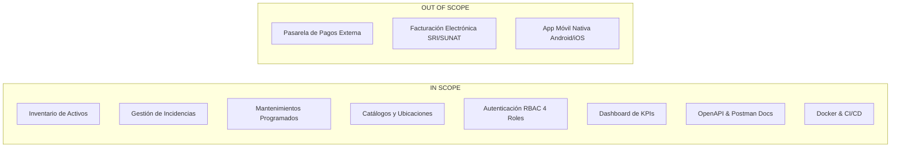
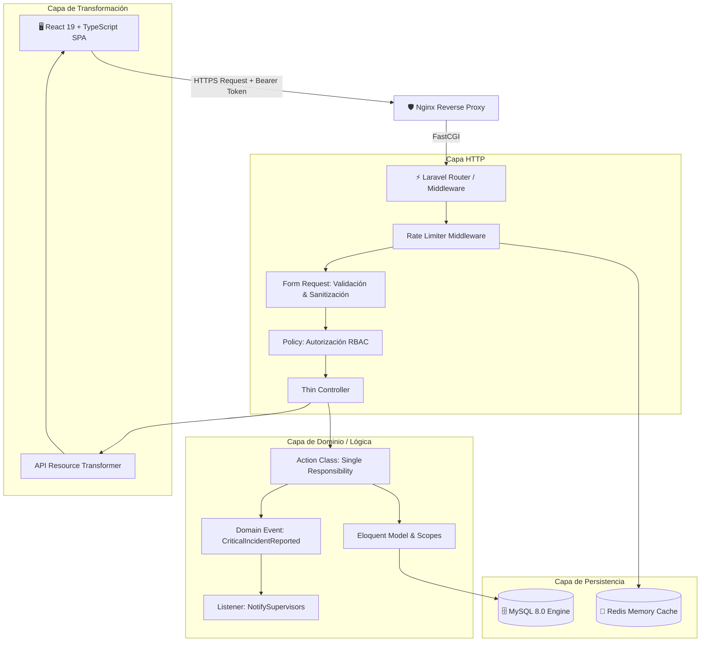
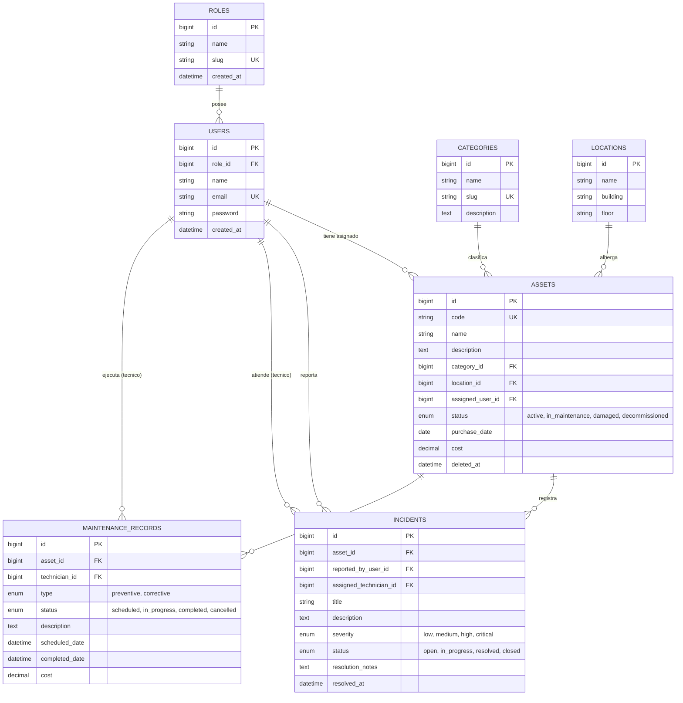
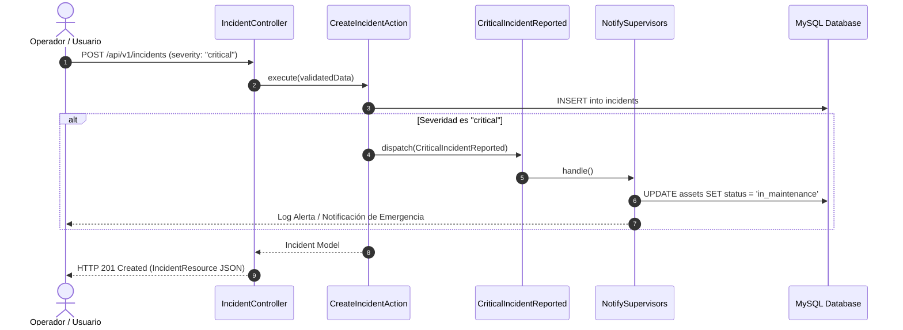

# 📄 Documento de Especificación de Requerimientos y Arquitectura del Sistema (SRS / ERS)

> **Proyecto:** Sistema Empresarial de Gestión de Activos Fijos, Incidencias y Mantenimiento Industrial  
> **Versión:** 1.0.0 (Release de Producción)  
> **Fecha de Elaboración:** Septiembre 2026  
> **Estado:** Completado y Verificado (100% Tests Green & CI/CD Validated)  
> **Autor:** Edu Chávez ([@educhavez25](https://github.com/educhavez25))  

---

## 📑 Tabla de Contenidos
1. [Ficha Técnica del Proyecto](#1-ficha-técnica-del-proyecto)
2. [Descripción General y Valor de Negocio](#2-descripción-general-y-valor-de-negocio)
3. [Alcance del Sistema (In Scope vs Out of Scope)](#3-alcance-del-sistema)
4. [Requerimientos Funcionales (RF)](#4-requerimientos-funcionales-rf)
5. [Requerimientos No Funcionales (RNF)](#5-requerimientos-no-funcionales-rnf)
6. [Arquitectura de Software y Patrones de Diseño](#6-arquitectura-de-software-y-patrones-de-diseño)
7. [Modelo de Datos y Base de Datos Relacional](#7-modelo-de-datos-y-base-de-datos-relacional)
8. [Matriz de Roles y Permisos (RBAC)](#8-matriz-de-roles-y-permisos-rbac)
9. [Módulos del Sistema y Lógica de Negocio](#9-módulos-del-sistema-y-lógica-de-negocio)
10. [Especificación de la API RESTful](#10-especificación-de-la-api-restful)
11. [Arquitectura del Frontend (SPA)](#11-arquitectura-del-frontend-spa)
12. [Seguridad y Hardening (OWASP Top 10)](#12-seguridad-y-hardening-owasp-top-10)
13. [Estrategia de Testing y Calidad (QA)](#13-estrategia-de-testing-y-calidad-qa)
14. [Infraestructura, Docker y Pipeline CI/CD](#14-infraestructura-docker-y-pipeline-cicd)
15. [Guía de Puesta en Marcha y Entrega](#15-guía-de-puesta-en-marcha-y-entrega)

---

## 1. Ficha Técnica del Proyecto

| Parámetro | Detalle |
| :--- | :--- |
| **Nombre del Sistema** | Sistema de Gestión de Activos y Mantenimiento Empresarial |
| **Tipo de Aplicación** | Full-Stack Web Application (Decoupled REST API + SPA) |
| **Lenguaje Backend** | PHP 8.2+ (Tipado estricto, Enums nativos, Constructor property promotion) |
| **Framework Backend** | Laravel 11.x (Sanctum, Action Pattern, Domain Events, Eloquent ORM) |
| **Lenguaje Frontend** | TypeScript 5.x (Strict mode, contratos tipados sincronizados con backend) |
| **Librería Frontend** | React 19 SPA (Hooks, Context API, Suspense ready) |
| **Enrutamiento UI** | React Router DOM v7 |
| **Gestión de Estado Servidor** | TanStack React Query v5 (Caché inteligente, invalidación reactiva) |
| **Diseño y Estilos** | Tailwind CSS 3.4 + Lucide React Icons |
| **Base de Datos** | MySQL 8.0 (Relacional, InnoDB, Foreign Keys, Soft Deletes) |
| **Caché y Throttling** | Redis 7 (In-memory key-value store) |
| **Servidor Web / Proxy** | Nginx Alpine (Reverse Proxy, FastCGI, compresión Gzip) |
| **Contenerización** | Docker & Docker Compose (Multi-stage build) |
| **Integración Continua** | GitHub Actions (CI Automatizado con 37 tests y validación Docker) |
| **Documentación API** | OpenAPI 3.1 (Dedoc Scramble) + Colección Postman v2.1 |

---

## 2. Descripción General y Valor de Negocio

### 2.1 Problema que Resuelve
En industrias manufactureras, centros de datos, hospitales y corporativos, la gestión desorganizada de la infraestructura física genera:
- **Tiempos de Inactividad No Planificados (*Unplanned Downtime*):** Falla de maquinaria crítica sin advertencia previa.
- **Pérdida de Trazabilidad:** Desconocimiento de la ubicación exacta, historial de reparaciones y costos acumulados por equipo.
- **Conflictos Operativos:** Asignación duplicada de mantenimientos sobre un mismo activo en horarios solapados.
- **Falta de Métricas Ejecutivas:** Incapacidad de calcular la tasa de disponibilidad de activos y costos globales de mantenimiento.

### 2.2 Solución Implementada
El sistema centraliza el ciclo de vida completo de cada activo corporativo:
1. **Inventario Jerárquico:** Registro unívoco con código de barra/inventario, costo, categoría y ubicación física.
2. **Gestión Reactiva de Emergencias:** Reporte de fallas con conmutación automática de estado (*Domain Event Driven*) cuando una incidencia es crítica.
3. **Planificación Preventiva y Correctiva:** Calendario y bitácora de mantenimientos con validación anti-colisión de agendas.
4. **Métricas en Tiempo Real:** Dashboard con KPIs de disponibilidad porcentual, desglose por severidad y costos totales.

---

## 3. Alcance del Sistema



---

## 4. Requerimientos Funcionales (RF)

### Módulo 1: Autenticación, Sesión y Usuarios
- **RF-01 (Registro de Usuario):** El sistema debe permitir a nuevos empleados registrarse indicando nombre, correo corporativo y contraseña con confirmación.
- **RF-02 (Inicio de Sesión):** Debe autenticar usuarios existentes mediante correo y contraseña, emitiendo un Bearer Token de Laravel Sanctum.
- **RF-03 (Protección Fuerza Bruta):** El endpoint de login debe bloquearse tras 5 intentos fallidos consecutivos por minuto por IP/email.
- **RF-04 (Consulta de Perfil `/me`):** El usuario autenticado debe poder consultar sus datos de perfil y rol asignado.
- **RF-05 (Cierre de Sesión):** El sistema debe revocar el token de acceso actual en el backend al cerrar sesión.
- **RF-06 (Listado de Personal):** Los administradores y supervisores deben poder listar a los usuarios y filtrar por rol (ej. listar únicamente técnicos).

### Módulo 2: Inventario de Activos Fijos
- **RF-07 (Listado Paginado de Activos):** El sistema debe retornar activos paginados (15 por página) con sus relaciones cargadas (`category`, `location`, `assignedUser`).
- **RF-08 (Búsqueda Full-Text):** Búsqueda en tiempo real por coincidencia parcial en `code` (código de activo) y `name` (nombre del activo).
- **RF-09 (Filtros Combinados):** Filtrado simultáneo por `status` (Enum: `active`, `in_maintenance`, `damaged`, `decommissioned`), `category_id` y `location_id`.
- **RF-10 (Ordenamiento Seguro):** Ordenamiento dinámico ascendente/descendente por campos permitidos (`name`, `code`, `cost`, `purchase_date`, `created_at`).
- **RF-11 (Creación de Activos):** Los Supervisores y Administradores pueden registrar activos validando unicidad de código, costo positivo y claves foráneas existentes.
- **RF-12 (Actualización de Activos):** Modificación de especificaciones técnicas, ubicación asignada y estado operativo.
- **RF-13 (Soft Deletion):** Exclusivo para Administradores. Eliminación lógica del activo preservando la integridad referencial de mantenimientos e incidencias pasadas.

### Módulo 3: Gestión de Incidencias y Fallas
- **RF-14 (Reporte de Incidencia):** Cualquier usuario autenticado puede reportar una incidencia vinculada a un activo, indicando título, descripción y nivel de severidad (`low`, `medium`, `high`, `critical`).
- **RF-15 (Conmutación Automática por Severidad Crítica):** Si la incidencia es `critical`, el sistema debe disparar un evento de dominio (`CriticalIncidentReported`) que cambia automáticamente el estado del activo a `in_maintenance` y notifica a los supervisores.
- **RF-16 (Asignación Técnica):** Posibilidad de delegar la resolución de una incidencia a un usuario con rol de Técnico.
- **RF-17 (Transición de Estados de Incidencia):** Flujo de estados permitido: `open` -> `in_progress` -> `resolved` -> `closed`. Solo técnicos asignados o superiores pueden cambiar el estado y registrar notas de resolución.

### Módulo 4: Mantenimientos Preventivos y Correctivos
- **RF-18 (Programación de Mantenimientos):** Los Supervisores pueden agendar mantenimientos preventivos o correctivos indicando fecha, costo estimado, técnico y descripción.
- **RF-19 (Validación Anti-Solapamiento):** El sistema debe rechazar la creación de mantenimientos si el activo ya posee otro mantenimiento activo (`scheduled` o `in_progress`) en conflicto.
- **RF-20 (Ejecución y Cierre de Mantenimiento):** Al iniciar un mantenimiento (`in_progress`), el activo pasa a `in_maintenance`. Al completarse (`completed`), el activo retorna automáticamente a `active`.

### Módulo 5: Catálogos y Métricas
- **RF-21 (Administración de Categorías):** CRUD de categorías con generación automática de slug.
- **RF-22 (Ubicaciones Físicas Jerárquicas):** Registro de sedes, plantas, edificios y salas.
- **RF-23 (Cálculo de KPIs Ejecutivos):** Endpoint `GET /api/v1/dashboard/stats` que calcula en tiempo real:
  - Total de activos y desglose por estado.
  - Tasa de disponibilidad operativa porcentual: `(activos activos / total activos) * 100`.
  - Conteo de incidencias abiertas y críticas.
  - Sumatoria acumulada de costos de mantenimiento preventivo vs correctivo.

---

## 5. Requerimientos No Funcionales (RNF)

| Código | Categoría | Descripción Técnica |
| :--- | :--- | :--- |
| **RNF-01** | **Rendimiento** | El tiempo de respuesta de la API para endpoints de consulta debe ser `< 100ms` en condiciones normales de red. |
| **RNF-02** | **Seguridad (Auth)** | Autenticación basada en Bearer Tokens opacos (Sanctum) con hashing `Bcrypt` (factor de costo 12) para contraseñas. |
| **RNF-03** | **Seguridad (OWASP)** | Protección contra SQL Injection mediante PDO Prepared Statements y prevención de Mass Assignment mediante Form Requests tipados. |
| **RNF-04** | **Rate Limiting** | Límite de 5 peticiones/min en endpoints de autenticación (`throttle:auth`) y 60 peticiones/min en rutas privadas (`throttle:api`). |
| **RNF-05** | **CORS** | Cabeceras restrictivas permitiendo únicamente orígenes autorizados del frontend (`http://localhost:5173`). |
| **RNF-06** | **Disponibilidad** | Arquitectura contenerizada lista para orquestación con reinicio automático (`restart: unless-stopped`). |
| **RNF-07** | **Escalabilidad** | Backend stateless desacoplado; sesiones y rate limiting delegables a Redis. |
| **RNF-08** | **Mantenibilidad** | Código bajo principios SOLID y Clean Architecture (Separación en Controllers, FormRequests, Actions, Resources, Policies). |
| **RNF-09** | **Integridad de Datos** | Claves foráneas con integridad referencial, transacciones ACID (`DB::transaction`) y Soft Deletes (`deleted_at`). |
| **RNF-10** | **Tipado Estricto** | TypeScript en modo estricto en el frontend y `declare(strict_types=1)` + Enums respaldados (*Backed Enums*) en PHP 8.2. |
| **RNF-11** | **Portabilidad** | Despliegue en 1 solo comando mediante `docker-compose.yml` multiplataforma (Linux, Windows, macOS). |
| **RNF-12** | **Calidad y CI/CD** | Pipeline automatizado de GitHub Actions con suite de 37 tests automatizados y 150 aserciones con 100% de éxito. |

---

## 6. Arquitectura de Software y Patrones de Diseño

El sistema implementa el patrón **Action-Domain-Responder (ADR)** combinado con **Arquitectura Dirigida por Eventos**:



### Patrones de Diseño Aplicados:
1. **Action Pattern:** Cada caso de uso complejo (`CreateAssetAction`, `UpdateIncidentStatusAction`) reside en su propia clase con método `execute()`.
2. **Transformer / API Resource Pattern:** Los modelos nunca se exponen crudos; se transforman mediante `AssetResource`, `IncidentResource` para ocultar campos sensibles y formatear fechas ISO-8601.
3. **Query Scope Pattern:** Consultas reutilizables en modelos (`scopeSearch`, `scopeFilterStatus`, `scopeSortBy`).
4. **Observer / Event-Listener Pattern:** Desacoplamiento de efectos secundarios mediante `CriticalIncidentReported` y `NotifySupervisorsOfCriticalIncident`.

---

## 7. Modelo de Datos y Base de Datos Relacional



---

## 8. Matriz de Roles y Permisos (RBAC)

| Módulo / Acción | 🛡️ Administrador | 📋 Supervisor | 🔧 Técnico | 👤 Usuario / Operador |
| :--- | :---: | :---: | :---: | :---: |
| **Login / Logout / Perfil** | ✅ | ✅ | ✅ | ✅ |
| **Ver Dashboard de KPIs** | ✅ | ✅ | ✅ | ✅ |
| **Consultar Activos (Lectura)** | ✅ | ✅ | ✅ | ✅ |
| **Crear / Editar Activos** | ✅ | ✅ | ❌ | ❌ |
| **Eliminar Activos (Soft Delete)** | ✅ | ❌ | ❌ | ❌ |
| **Reportar Incidencia** | ✅ | ✅ | ✅ | ✅ |
| **Cambiar Estado de Incidencia** | ✅ | ✅ | ✅ *(si está asignado)* | ❌ |
| **Programar Mantenimientos** | ✅ | ✅ | ❌ | ❌ |
| **Completar Mantenimiento** | ✅ | ✅ | ✅ | ❌ |
| **Gestionar Catálogos (Categorías/Ubicaciones)**| ✅ | ✅ | ❌ | ❌ |
| **Listar y Filtrar Usuarios** | ✅ | ✅ | ❌ | ❌ |

---

## 9. Módulos del Sistema y Lógica de Negocio

### 9.1 Módulo de Activos
- **Generación de Código:** Debe ser único alfanumérico (ej. `ACT-LAP-001`, `ACT-MAQ-042`).
- **Estados del Activo:**
  - `active`: Activo en operación normal.
  - `in_maintenance`: Activo en mantenimiento preventivo o reparación tras falla.
  - `damaged`: Activo fuera de servicio por daño severo pendiente de diagnóstico.
  - `decommissioned`: Activo retirado del inventario (baja patrimonial).

### 9.2 Módulo de Incidencias Críticas


### 9.3 Módulo de Mantenimientos
- **Regla Anti-Colisión:** Antes de persistir un registro en `maintenances`, se valida que no existan mantenimientos coincidentes para el mismo `asset_id` con estados `scheduled` o `in_progress`.
- **Restauración de Estado:** Cuando el estado cambia a `completed`, el activo pasa de `in_maintenance` a `active`.

---

## 10. Especificación de la API RESTful

Todos los endpoints responden bajo el estándar **JSON:API** con la estructura envelope `data`:

### Resumen de Endpoints Principales:

```http
### 1. Autenticación
POST /api/v1/auth/register
POST /api/v1/auth/login
GET  /api/v1/auth/me
POST /api/v1/auth/logout

### 2. Dashboard & Analítica
GET  /api/v1/dashboard/stats

### 3. Activos Fijos
GET    /api/v1/assets?search=servidor&status=active&sort_by=cost&sort_direction=desc&page=1
POST   /api/v1/assets
GET    /api/v1/assets/{id}
PUT    /api/v1/assets/{id}
DELETE /api/v1/assets/{id}

### 4. Incidencias
GET    /api/v1/incidents?severity=critical&status=open
POST   /api/v1/incidents
GET    /api/v1/incidents/{id}
PATCH  /api/v1/incidents/{id}/status

### 5. Mantenimientos
GET    /api/v1/maintenances?status=scheduled
POST   /api/v1/maintenances
GET    /api/v1/maintenances/{id}
PUT    /api/v1/maintenances/{id}

### 6. Catálogos
GET    /api/v1/categories
POST   /api/v1/categories
GET    /api/v1/locations
POST   /api/v1/locations
GET    /api/v1/users?role=tecnico
GET    /api/v1/roles
```

---

## 11. Arquitectura del Frontend (SPA)

- **Diseño Atómico & UI Kit:** Componentes reutilizables sin librerías pesadas externas ([`Button`](file:///c:/Users/Usuario/Desktop/Proyectos/gestion-activos-mantenimiento/frontend/src/components/ui/Button.tsx), [`Badge`](file:///c:/Users/Usuario/Desktop/Proyectos/gestion-activos-mantenimiento/frontend/src/components/ui/Badge.tsx), [`Card`](file:///c:/Users/Usuario/Desktop/Proyectos/gestion-activos-mantenimiento/frontend/src/components/ui/Card.tsx), [`Modal`](file:///c:/Users/Usuario/Desktop/Proyectos/gestion-activos-mantenimiento/frontend/src/components/ui/Modal.tsx), [`Input`](file:///c:/Users/Usuario/Desktop/Proyectos/gestion-activos-mantenimiento/frontend/src/components/ui/Input.tsx), [`Pagination`](file:///c:/Users/Usuario/Desktop/Proyectos/gestion-activos-mantenimiento/frontend/src/components/ui/Pagination.tsx)).
- **Interceptores de Transporte (`axiosClient.ts`):** Inyección automática de cabecera `Authorization: Bearer <token>` y captura global de respuestas `401 Unauthorized` para redirección limpia al login.
- **Rutas Protegidas (`ProtectedRoute.tsx`):** Guarda de navegación en React Router que valida el token y los roles permitidos antes de montar componentes privados.
- **Botones Demo 1-Click:** En la pantalla de login para permitir pruebas inmediatas con cualquiera de las 4 cuentas sembradas.

---

## 12. Seguridad y Hardening (OWASP Top 10)

1. **A01:2021 - Broken Access Control:** Resuelto mediante Policies de Laravel (`AssetPolicy`, `IncidentPolicy`, `MaintenanceRecordPolicy`) y Gate `before` para Super-Admin.
2. **A02:2021 - Cryptographic Failures:** Contraseñas hasheadas con Bcrypt factor 12. Tokens Sanctum almacenados como hash SHA-256 en la base de datos.
3. **A03:2021 - Injection:** Protección contra SQL Injection mediante el ORM Eloquent y PDO con variables parametrizadas.
4. **A04:2021 - Insecure Design / Rate Limiting:** `throttle:auth` (5 peticiones/min) y `throttle:api` (60 peticiones/min) para mitigación de fuerza bruta y DoS.
5. **A05:2021 - Security Misconfiguration:** Headers de seguridad Nginx (`X-Frame-Options: SAMEORIGIN`, `X-Content-Type-Options: nosniff`, `X-XSS-Protection: 1`).

---

## 13. Estrategia de Testing y Calidad (QA)

El backend cuenta con una suite completa de **37 pruebas automatizadas y 150 aserciones** ejecutadas sobre **PHPUnit** en base de datos en memoria:

```
  PASS  Tests\Unit\ExampleTest (1 test)
  PASS  Tests\Feature\Asset\AssetManagementTest (8 tests)
        ✓ authenticated user can list assets
        ✓ supervisor can create asset with action rules
        ✓ regular user cannot create asset
        ✓ supervisor can update asset
        ✓ admin can delete asset while others cannot
        ✓ user can search assets by code or name
        ✓ user can filter assets by status
        ✓ user can sort assets
  PASS  Tests\Feature\Auth\AuthenticationTest (8 tests)
        ✓ a user can register with valid data
        ✓ registration fails with invalid email
        ✓ registration fails when email already exists
        ✓ a user can login with correct credentials
        ✓ login fails with incorrect password
        ✓ an authenticated user can access the me endpoint
        ✓ a guest cannot access the me endpoint
        ✓ a user can logout and the token is revoked
  PASS  Tests\Feature\Catalog\CatalogManagementTest (4 tests)
  PASS  Tests\Feature\Dashboard\DashboardStatsTest (2 tests)
  PASS  Tests\Feature\Incident\IncidentManagementTest (5 tests)
        ✓ critical incident changes asset status to maintenance
        ✓ assigned technician can resolve incident
        ✓ unauthorized user cannot update incident status
  PASS  Tests\Feature\Maintenance\MaintenanceManagementTest (6 tests)
        ✓ cannot schedule overlapping maintenance for same asset
        ✓ in progress maintenance sets asset to in maintenance
        ✓ completing maintenance restores asset status
  PASS  Tests\Feature\Security\RateLimitingTest (2 tests)
        ✓ auth endpoints are rate limited after too many attempts
        ✓ authenticated api routes include rate limiting headers

  TOTAL: 37 passed (150 assertions)
```

---

## 14. Infraestructura, Docker y Pipeline CI/CD

### 14.1 Topología Docker Compose
- **Contenedor `db`:** MySQL 8.0 con volumen persistente `db_data` y healthcheck `mysqladmin ping`.
- **Contenedor `redis`:** Redis Alpine para colas y caché.
- **Contenedor `backend`:** PHP 8.2 FPM Alpine optimizado con extensiones compiladas.
- **Contenedor `nginx`:** Nginx Alpine actuando como reverse proxy FastCGI para Laravel.
- **Contenedor `frontend`:** React 19 compilado en multi-stage y servido sobre Nginx Alpine con Gzip.

### 14.2 Pipeline de Integración Continua (GitHub Actions)
En cada `push` o `pull_request` a las ramas `main` o `develop`, GitHub Actions ejecuta en paralelo:
1. 🟢 **Backend CI:** Configuración de PHP 8.2, resolución de dependencias Composer, verificación de permisos y ejecución de los 37 tests PHPUnit.
2. 🟢 **Frontend CI:** Instalación de dependencias Node 20, validación de tipos TypeScript y compilación de producción con Vite.
3. 🟢 **Docker Validation:** Construcción completa de las imágenes Docker para certificar que el despliegue es 100% reproducible.

---

## 15. Guía de Puesta en Marcha y Entrega

### 15.1 Credenciales de Demostración

| Rol | Correo Electrónico | Contraseña |
| :--- | :--- | :--- |
| **Administrador** | `admin@example.com` | `password` |
| **Supervisor** | `supervisor@example.com` | `password` |
| **Técnico** | `tecnico@example.com` | `password` |
| **Usuario Operador** | `usuario@example.com` | `password` |

### 15.2 Comandos Rápidos de Despliegue

```bash
# 1. Clonar el repositorio
git clone https://github.com/educhavez25/gestion-activos-mantenimiento.git
cd gestion-activos-mantenimiento

# 2. Levantar con Docker Compose
cp .env.docker.example .env
docker compose up -d --build
docker compose exec backend php artisan migrate --seed

# 3. Acceder al sistema
# Frontend: http://localhost:5173
# Documentación Swagger: http://localhost:8000/docs/api
```

---

## 🏁 Conclusión del Documento de Entrega

El presente documento certifica que el **Sistema de Gestión de Activos y Mantenimiento Empresarial** ha sido diseñado, implementado, testeado y contenerizado conforme a las mejores prácticas de la industria del software.

El sistema se encuentra listo para entrega, evaluación técnica o despliegue en entornos productivos.
